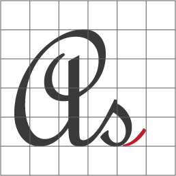

# 

# Project architecture document.

- Review the [Architecture Diagram](architecture/README.md).
- Folder design information of the application.

```
.
+-- build                           '	Executable version of the project.
+-- docs						    '	Project, documents.
+-- .devcontainer                   '	Project, development configuration.
+-- .docker                         '	Project, docker file.
|   +-- .env                        '	each env. the file holds or separates the development environment definitions.
|   +-- docker-compose.yaml         '	each .yml file holds or separates runtime definitions.
|   +-- Dockerfile                  '	each docker file prepares the runtime launcher image.
+-- reports                         '	Project, coverage, test, screen.
|   +-- coverage                    '	Project, coverage web content
|   |   ?-- index.html              '	Project, coverage report static file
|   +-- document                    '	Project, document web content.
|   |   ?-- index.html              '	Project, document report static file
|   +-- tests                       '	Project, test and coverage result.
|   |   +-- cobertura-coverage.xml  '	Project, coverage result.
|   |   +-- junit.xml               '	Project, Unit test result.
|   +-- screen                      '	Project, e2e screens.
+-- src							    '	Project resource files.
|   ?-- api					        '	In-app services.
|   ?-- assets			            '	Design assets.
|   ?-- controllers	                '	The parts that separate the business logic of the application and the user interface.
|   ?-- core					    '	Application core.
|   ?-- models					    '	View objects that separate the Controller From the user interface.
|   ?-- views					    '	The area users view with models.
+-- tests                           '	Project testing.
|   +-- e2e						    '	End-to-end test.
|   +-- unit					    '	Unit test.
|   +-- integration                 '	Integration testing.
+-- .editor.config                  '	Developers will use these code indents and styles in their IDEs.

```

# Web Service Template

This project is a template for building automation systems in web projects. It utilizes Flask, a popular Python web framework, to provide a simple web service structure.

## Installation

1. Clone the repository:

   ```bash
   git clone https://github.com/azmisahin/azmisahin-software-web-service-template-flask-python-v1.git
   ```

2. Navigate to the project directory:

   ```bash
   cd azmisahin-software-web-service-template-flask-python-v1
   ```

3. Create a virtual environment (optional but recommended):

   ```bash
   python -m venv venv
   ```

4. Activate the virtual environment:

   - Windows:

     ```bash
     .\venv\Scripts\activate
     ```

   - Unix or MacOS:

     ```bash
     source venv/bin/activate
     ```

5. Install project dependencies:

   ```bash
   pip install -e .
   ```

## Usage

Run the web service using the provided console script:

```bash
web-service-template run
```

## SSL/TLS certificate
If you have not yet created an SSL/TLS certificate and do not have an existing certificate file, you can create a temporary certificate in a few steps. The following commands will create a temporary certificate containing its own private key and certificate:

```bash
openssl req -x509 -newkey rsa:4096 -nodes -keyout private-key.pem -out public-cert.pem -days 365
```
This command creates the private key (private-key.pem) and certificate (public-cert.pem) files. The -days parameter determines the validity period of the certificate; In the example above it is set to 365 days.

If you are going to use it in a real project, it is recommended that you obtain a valid SSL/TLS certificate from a certificate authority (CA). These certificates are usually provided for a fee or free of charge. You can also get free SSL/TLS certificates from a service like Let's Encrypt.
